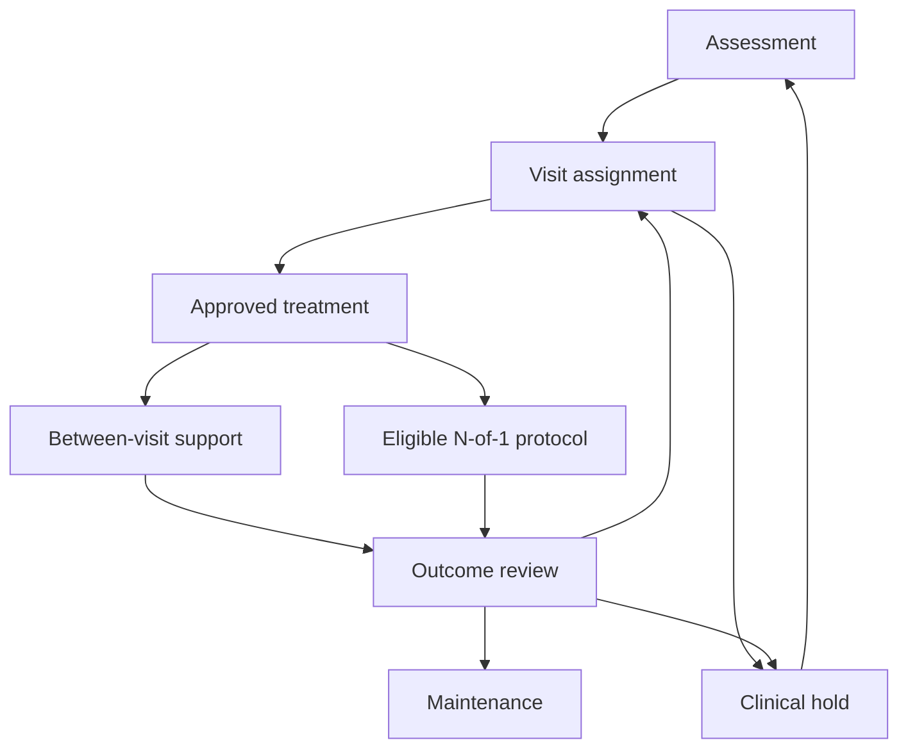

# Development plan: clinician workflow app for insomnia during leukemia chemotherapy

**Design date:** October 4, 2026 (revised after clinical and methods review, same date; see the revision log at the end)
**Deliverable:** a working demonstration built entirely with synthetic patients, study results, EMR events, and Oura-like records.
**Primary users:** outpatient leukemia clinicians, with nursing and behavioral sleep care roles.
**Scope:** adults receiving chemotherapy; usual outpatient appointments plus between-visit monitoring. Pediatric care, inpatient care, transplantation, and end-of-life care require separate pathways and validation.

## 1. Recommendation and intended demonstration

Build the recommended hybrid workflow:

1. **At outpatient decision points:** a hierarchical Bayesian longitudinal causal model estimates the outcomes of clinically eligible treatment plans. A robust prior borrows cautiously from compatible previous studies.
2. **For suitable reversible comparisons:** a clinician-approved randomized N-of-1 protocol generates patient-specific evidence, with explicit carryover, withdrawal/rebound, adherence, and stopping rules.
3. **For durable behavioral treatment:** maintain CBT-I or brief behavioral treatment as a continuing intervention; use a separate sequential randomized escalation pathway rather than withdrawing acquired skills for crossover.
4. **Between appointments:** first use micro-randomized trials (MRTs) of the delivery of already approved behavioral support. Then demonstrate a bounded hierarchical contextual bandit that optimizes those support decisions.
5. **Throughout:** clinicians control treatment assignment. Clinical eligibility rules restrict the action set before the model ranks options. Every randomized component (N-of-1, sequential escalation, MRT, bandit) additionally requires a recorded consent and oversight status before any assignment is drawn (section 2.1).

This composition connects population evidence, prospective individual learning, and modest online adaptation while preserving the different timescales and assumptions of each method. Bayesian g-computation, Bayesian N-of-1 analysis, MRTs, and hierarchical contextual bandits provide established methodological starting points.[^gformula][^n1bayes][^mrt][^pooling] Their combination in this leukemia insomnia app is a proposed design, not an already validated clinical intervention.

The demonstration must show the full loop: ingestion → assessment → eligible choices → posterior estimates → clinician approval or randomization → simulated delivery → outcomes → model update → next decision → historical review. "Full machinery" includes failures, abstention, and audit trails, as well as successful personalization.

**Cold-start qualification:** previous studies can inform average effects and uncertainty. They cannot establish a new patient's treatment response, identify an unmeasured confounder, create overlap, or supply Oura-based effect modifiers absent from the studies.

### Alternative compositions

| Composition | How it works | Advantages | Limitations | Decision |
|---|---|---|---|---|
| Bayesian population model at visits | Borrow study evidence, update with historical EMR and prospective outcomes, rank eligible plans | Simplest workflow; explicit uncertainty; works before individual experiments accumulate | Individual conclusions may remain prior-driven; observational identification and transport assumptions remain substantial | Useful first development milestone |
| N-of-1 centered workflow | Each suitable patient completes repeated randomized comparisons with hierarchical pooling | Direct evidence about that patient's reversible treatment choices; assignment probabilities are known | Carryover, withdrawal/rebound, unstable chemotherapy phases, burden, and limited suitable options; durable CBT-I learning does not wash out | Optional branch, not the default for every patient |
| **Recommended hybrid** | Bayesian visit decisions + selected N-of-1 protocols + sequential behavioral escalation + constrained support bandit | Uses each method where its assumptions fit; supports ordinary outpatient follow-up; separates treatment choice from support delivery | More engineering; requires estimand discipline and explicit coordination rules across learning components (section 3.1) | **Build this demonstration** |
| Long-horizon treatment RL | Optimize treatment sequences and delayed outcomes across visits | Could address multi-step treatment tradeoffs | Demands a credible state representation, adequate exploration/support, delayed-outcome evaluation, and reliable safety constraints; simulation performance would not establish clinical validity | Future research extension; not the clinical assignment engine in this prototype |

The contextual bandit is the initial online reinforcement-learning component. It optimizes proximal support delivery; it does not claim to optimize the entire chemotherapy insomnia trajectory. Longer-horizon policy evaluation may be demonstrated offline, with its assumptions stated separately.[^actionbandit][^ope]

## 2. Clinical pathway and boundaries

Start with clinical assessment, not a sleep score. The cancer insomnia guideline and cancer symptom workflow support assessing insomnia symptoms, daytime consequences, contributing conditions, and treatment options.[^esmo][^ontario][^nci]

| Step | Information and action | Representation in the prototype |
|---|---|---|
| Confirm the problem | Sleep history, patient goals, insomnia severity, daytime impairment, sleep opportunity, and a diary; clinician considers alternative or coexisting sleep disorders | Structured assessment plus notes; ISI (with its version and recall interval) and diary are visible beside wearable estimates |
| Identify contributors | Chemotherapy phase, corticosteroid exposure, pain, nausea, distress, fatigue, naps, other medications including already-prescribed sedating agents, and possible breathing or movement disorders | A dated contributor list with evidence source, review status, and responsible clinician |
| Address contributors | Coordinate symptom management and any changes to oncology or supportive medicines with the relevant clinician | Tasks and referrals; the optimizer cannot independently change chemotherapy or corticosteroids |
| Select behavioral care | Offer evidence-based behavioral insomnia care suited to treatment burden and clinical stability | Continuing brief behavioral or CBT-I program, with adherence and skills tracked |
| Consider medication | Review existing therapy, interactions, contraindications, sedation and fall risk, and clinical need; specify a reassessment and stop/review date | Clinician-controlled medication choice; synthetic agents in demonstrations |
| Reassess | Review symptoms, function, harms, adherence, goals, and whether the treatment is still appropriate | Outcome review at usual appointments; interim review when a configured clinical trigger occurs |

ESMO recommends CBT-I as first-line therapy for insomnia in adults with cancer and distinguishes the role of brief behavioral interventions during active treatment; medication requires cautious use and review.[^esmo] Severe sleepiness and medical instability are reasons to adapt or defer relevant behavioral components, including sleep restriction, rather than apply a uniform digital protocol. The VA/DoD provider material, for example, lists an uncontrolled seizure disorder as a reason to delay and bipolar disorder as a reason to adapt.[^va] These are clinician-entered eligibility flags in the prototype, not automated determinations.

Use leukemia-specific clinical context to determine eligibility and transportability. The cited brief behavioral therapy trial during chemotherapy randomized 71 patients with breast cancer and was designed as a feasibility and acceptability study; it is relevant external evidence but is not equivalent to a leukemia chemotherapy trial, and its effect estimate is preliminary.[^palesh] The app must visibly identify such population differences.

**ISI interpretation.** The ISI is a seven-item, 0–28 self-report scale that has been validated in a large mixed-cancer sample, where a score of 8 performed as the screening cut-off.[^savard] It has not, to our knowledge, been validated specifically in leukemia chemotherapy. Change thresholds in the literature have different origins: a 6-point minimally important difference derived from a hypnotic drug trial, and a change of about 8 points associated with moderate improvement in a behavioral-treatment sample.[^isi_mid] The prototype therefore (a) treats any benefit threshold as a named, configurable, clinician-agreed parameter rather than a built-in constant, and (b) records the ISI version and recall interval with every administration, because two-week and one-month forms are both in circulation and must not be trended against each other.

**Wearable limits.** Oura measurements are supportive observations. The cited validation study enrolled 96 healthy Japanese adults aged 20–70 and was partly funded by the manufacturer; it does not establish accuracy in leukemia chemotherapy.[^oura_validation] Consumer wearables generally detect sleep with high sensitivity but detect wake poorly (specificity of roughly 29–52% across six devices in one polysomnography comparison), so they tend to overestimate sleep where wake time is high, which is exactly the insomnia case.[^wearable_spec] Oura states that the ring is not a medical diagnostic device.[^oura_conditions] Do not diagnose insomnia, infer remission, or prescribe from a proprietary readiness or sleep score. The prototype also does not monitor wearable temperature or heart-rate signals for infection or other acute illness, and must say so in the interface.

**Medication demonstration rules.** For the runnable demonstration, use fictional medication identifiers MED_A and MED_B with simulated kinetics and harms. Do not encode real doses or simulated "clinical efficacy" as if it were evidence. A separately sourced illustrative interaction rule shows how medication exclusions work, and should demonstrate two distinct rule outcomes because the label does: the suvorexant label states that use with strong CYP3A inhibitors (posaconazole is named) is not recommended, and that a reduced dose applies with moderate CYP3A inhibitors (fluconazole, aprepitant, and imatinib are named).[^suvorexant] The first is an exclusion; the second is a "requires prescriber review" flag. Both co-medication classes are plausible in leukemia care, which is why the example is useful, but it must not become a comprehensive medication recommendation engine.

**Fall risk.** Sedative-hypnotic use was an independent risk factor for falls among hospitalized patients with hematological disease in one cohort.[^falls] That evidence is inpatient and observational, so its transport to this outpatient population is uncertain; the prototype represents it only as a clinician-reviewed fall-risk item on the readiness panel that must be acknowledged before a sedating option is approved or entered into an N-of-1 protocol.

**Acute concerns.** Acute clinical concerns enter a clinical review/hold pathway. The prototype routes them to a designated care task and pauses experimental assignment; it does not provide automated emergency diagnosis or replace existing oncology escalation procedures. Hold triggers are configured by the clinical team in Phase 0; the simulator should include at least fever or suspected infection, new confusion, a fall, hospital admission, and a regimen change.

### 2.1 Research oversight and consent

N-of-1 trials sit on a contested boundary between clinical care and research. A survey reported by Stunnenberg and colleagues found that 43% of responding IRBs regarded them as research requiring approval, while others treated them as care or decided case by case.[^n1ethics] Sequential randomization across patients, MRTs, and an adaptive bandit are designed to produce generalizable knowledge and should be assumed to need ethics review in any real deployment.

For the synthetic demonstration, model this explicitly rather than ignoring it:

- Each patient carries a per-component consent and oversight record (N-of-1, behavioral escalation randomization, MRT/bandit), with status, date, version, and withdrawal.
- The policy controller treats a missing, expired, or withdrawn record as an eligibility exclusion. No randomization is drawn without it.
- Withdrawal stops future assignment and is logged; it does not delete prior assignment records.

The actual oversight determination belongs to the clinical translation project (section 18).

## 3. Workflow state and decision ownership

Model clinical state, experiment state, data readiness, and the selected historical view separately. A patient can be on an approved behavioral program while also having a pending medication review; one flat "step number" would misrepresent this.

**Clinical state**

- Assessment: information gathering and contributor review.
- Initial assignment: a visit-level plan is being selected.
- Treatment active: the approved plan is being delivered.
- Scheduled reassessment: a visit reviews response and the next plan.
- Maintenance/closeout: continue, taper/review where appropriate, or close the insomnia episode.
- Clinical hold: reassess safety or a major change before resuming experimental choices.

**Parallel learning state**

- No individual experiment.
- N-of-1 eligibility/design.
- N-of-1 block active.
- N-of-1 interim/final review.
- Behavioral escalation decision.
- MRT/bandit support active, frozen, or unavailable.

The learning state never overrides the clinical state. A medication order, a randomized assignment, and a delivered intervention are different events.

Any state can enter a hold through the clinical controller. The diagram illustrates the principal loop rather than every possible transition.

**Ownership:** clinicians select and approve treatment plans; nurses manage designated follow-up tasks; behavioral clinicians review program components; the research/statistics configuration defines permitted experimental comparisons. The bandit selects only a support action inside the envelope previously approved for that patient.

### 3.1 Coordination between concurrent learning components

The N-of-1 endpoint (daily reported sleep quality) and the support-prompt reward (next-morning report) are the same kind of observation on the same nights. If the bandit adapts its prompt probabilities to outcomes while an N-of-1 block is running, prompt intensity can become correlated with the block treatment through the outcomes it is reacting to, and the N-of-1 contrast is then defined relative to a support policy that is drifting. This is a design consequence of running two learners on one outcome stream, not a finding from a specific study, so it is handled by rule and then tested in simulation (section 6):

- While an N-of-1 block or its washout is active, the support policy for that patient is **frozen** to a fixed, prespecified randomization (or fixed support). Adaptive updating for that patient resumes after the N-of-1 review.
- Each estimand contract names the support policy in force (section 4), so the N-of-1 and visit-level effects are interpretable as "under support policy version X."
- Pooled bandit updates may continue to use other patients' data.
- A newly randomized escalation assignment likewise records the support policy version in force.

## 4. Estimands before algorithms

Write an estimand contract for every decision type. Specify the eligible population, intervention version, comparator, assignment versus delivery, time zero, outcome, horizon, continuation policy, concurrent support policy, intercurrent-event strategy, missing-data assumptions, and analysis assumptions. Align the historical analysis with a target-trial specification.[^targettrial]

| Decision | Primary causal question | Endpoint and horizon | Data suitable for identification |
|---|---|---|---|
| Initial or revised visit plan | What is the expected effect of assigning eligible plan A versus B now, under a common subsequent decision policy? | ISI at a prespecified distal horizon, with function and harms alongside it | Compatible trials; historical data with adequate exposure/outcome/confounder information; prospective decision data |
| N-of-1 medication comparison | For this patient, what is the effect of assigning A versus B during an eligible block? | Daily reported sleep quality or another prespecified proximal outcome; adverse effects and function | Randomized block assignment, delivery/adherence records, and longitudinal outcomes |
| Behavioral escalation | For eligible nonresponders, what is the effect of continuing versus escalating an ongoing program? | Later ISI/function, at a defined horizon | Sequential randomized assignments or carefully specified longitudinal observational analysis |
| Support prompt | Among available decision points, what is the causal excursion effect of offering a permitted support action versus no prompt, averaged over the support policy that generated the preceding history? | Next-morning report and prompt burden | MRT/bandit assignment logs, availability records, and outcomes |

For a visit at time $t$, define:

$$
\Delta_t(h; a, b, \pi, K) = E\left[\,Y_{t+K}^{a,\pi} - Y_{t+K}^{b,\pi} \;\middle|\; H_t = h,\ a, b \text{ eligible}\right].
$$

Here $H_t$ contains only information available before assignment. The same continuation policy mapping $\pi$ applies after either initial assignment; resulting histories can differ. Freeze and record its version for each prediction. Lower ISI is better, so a negative contrast favors $a$.

For the demo, a six-week distal outcome and appointment-aligned reassessments are engineering choices. A trial reporting a six-week ISI effect can inform a compatible six-week comparison; its estimate cannot simply become a next-night sleep-duration or prompt-effect prior. Because the ISI asks about a recall window, an administration shortly after a treatment change mixes pre- and post-change nights; the contract must state the earliest post-assignment ISI that counts as an outcome for that assignment.

**Intercurrent events.** "Censoring" is not an adequate description of what happens to these patients within a six-week horizon. The ICH E9(R1) framework separates intercurrent events from missing data and offers five handling strategies: treatment policy, hypothetical, composite, while-on-treatment/while-alive, and principal stratum. The treatment-policy strategy cannot be applied to a terminal event such as death, after which the outcome does not exist.[^iche9] Each contract therefore lists, per event, the chosen strategy. The demonstration defaults, which are engineering choices to be reviewed in Phase 0, are:

| Intercurrent event | Default strategy in the demo | Consequence |
|---|---|---|
| Death | While-alive for ISI; death reported as a separate outcome | No ISI is imputed after death; do not treat as ignorable censoring |
| Hospital admission / leaving outpatient scope | Reported as a separate outcome; ISI contrast defined while in scope, with a sensitivity analysis | Admission also triggers a clinical hold |
| Chemotherapy regimen or steroid schedule change | Treatment policy (part of real-world care) | Outcome still collected; phase recorded as a covariate after assignment, not conditioned on as baseline |
| Rescue hypnotic use | Treatment policy for the primary contrast; reported alongside | Do not exclude rescue nights |
| Discontinuation or clinician override of the assigned plan | Treatment policy (effect of assignment) | Per-protocol effects need separate assumptions |

Primary randomized analyses estimate effects of assignment. If a clinician overrides a randomized proposal or a patient does not take it, retain both assignment and actual treatment. Per-protocol effects need additional assumptions; do not obtain them by restricting the analysis to adherent patients.

**Blinding.** Record for every randomized comparison whether the patient and clinician are blinded. The N-of-1 outcome is patient-reported, so an open-label comparison estimates the effect of *knowingly* receiving A versus B, expectancy included. That may be the clinically relevant quantity, but it must be labeled as such and must not be pooled with blinded evidence without a term for the difference.

CATE is a conditional average effect. A patient-specific posterior incorporating their repeated observations is still a model-based expectation; it does not reveal both realized potential outcomes for that person.

## 5. Data contracts, timing, and provenance

Use versioned contracts and a replay clock. Every clinical or wearable record needs an event time and an availability time. Prediction snapshots must use the latter to prevent future information from leaking backward.

| Entity | Minimum fields |
|---|---|
| Patient | Synthetic ID; demographic/clinical covariates; preferences; baseline eligibility; care team |
| Consent/oversight record | Component (N-of-1, escalation randomization, MRT/bandit), status, version, date, withdrawal time |
| Encounter | Encounter ID, scheduled/actual time, care setting, chemotherapy phase/cycle, review status |
| Medication order | Drug identifier, intended schedule, order/change/stop times, ordering clinician, source |
| Medication exposure | Actual taken/reported administration, timing, adherence, rescue use, uncertainty |
| Clinical observation | Concept, value, unit, event time, available-at time, source, corrected/superseded status |
| Intercurrent event | Type (death, admission, regimen change, discontinuation, rescue), event and available-at times, source |
| Oura-like observation | Record type, sleep episode/date, estimated sleep/wake measures, source/device version, event and sync times, quality/missingness flags |
| Patient report | Daily diary/function/adverse symptoms; ISI items, instrument version, and recall interval; patient goals and burden |
| External study | Population, intervention/comparator, outcome/scale, follow-up, effect/SE or IPD, covariate distribution, blinding, bias/transport notes, source/version |
| Decision snapshot | History cutoff, workflow state, eligible actions and reasons, outcome/horizon, posterior/model/evidence/policy versions, support policy version in force |
| Assignment event | Recommended option, approved option, experimental assignment, assignment probability, blinding status, clinician override and reason |
| Delivery event | Offered/delivered/taken action, time, adherence, rescue, protocol deviation |
| Follow-up task | Owner, due date, trigger, status, escalation destination |
| Audit/model run | Actor, change, versions, fit diagnostics, execution time, reproducible seed, data lineage |
| Simulator truth | Latent states, structural parameters, counterfactual outcomes; accessible only to evaluation services |

Use a FHIR-shaped EMR adapter and a versioned Oura replay adapter. Consult SMART App Launch and Oura's official API documentation when implementing actual interfaces.[^smart][^oura_api] Do not represent a mock payload as a guaranteed current vendor schema.

Keep units, timezone, overnight episodes crossing midnight, local calendar dates, lab reference context, duplicates, late uploads, and corrections explicit. A prescribed drug is not evidence that it was taken. Absence of a wearable record is not evidence of poor sleep or clinical stability.

Historical EMR lacking insomnia measures, treatment details, or essential confounders cannot supply a trustworthy efficacy estimate merely because it has many patients. Historical records lacking Oura cannot identify Oura-treatment interactions.

## 6. Synthetic data and simulator

The simulator is a causal environment with separate data export and hidden truth, not an arbitrary table of correlated fields.

### Default engineering presets

| Preset | Historical cohort | Synthetic external trials | Prospective cohort | Purpose |
|---|---:|---:|---:|---|
| Smoke | 100 trajectories | 2 small studies | 6 trajectories | Fast contract/UI checks |
| Demonstration | 2,000 trajectories | 4 studies with approximately 150–250 participants each | 60 trajectories over 12 weeks | End-to-end replay and worked patient cases |
| Evaluation | Configurable | Configurable | Configurable | Repeated simulations and sensitivity analyses |

These sizes are software defaults, not sample-size recommendations or promises of adequate clinical precision. Numerical treatment effects, kinetics, missingness, and decision thresholds in the simulator are invented engineering parameters and labeled accordingly. With two or four external studies the between-study heterogeneity is essentially not estimable from the data, so the borrowed prior in these presets is dominated by the heterogeneity prior (section 7.3); the smoke preset checks plumbing only and must not be used to illustrate borrowing behavior.

### Structural components

1. Baseline variation: leukemia/therapy strata, baseline insomnia, comorbidity, preferences, site, and measured effect modifiers.
2. Daily clinical state: chemotherapy phase, steroid exposure, pain, nausea, distress, fatigue, naps, and previous sleep.
3. Treatment assignment: historical clinicians respond to severity and measured clinical state, producing confounding by indication. Some states deliberately have poor overlap.
4. Treatment delivery: adherence, clinician overrides, rescue therapy, and missed support are generated separately from assignment.
5. Durable behavioral learning: a cumulative skills state influences later sleep. Turning off a reminder does not erase learned CBT-I skills.
6. Reversible medication dynamics: fictional onset/offset and carryover states, with patient-specific benefit and harm variation. Include a configurable withdrawal/rebound state in which sleep after stopping is transiently *worse than baseline*, because rebound insomnia after discontinuation is documented for some hypnotics and is not the same thing as residual benefit decaying to zero.[^rebound]
7. Sleep and function: latent sleep/wake and next-day function, autocorrelation, phase-dependent drift, and outcome-specific treatment effects.
8. Measurement: Oura-like estimates include quiet-wake misclassification, symptom-dependent bias, algorithm changes, and missing nights; diaries have a separate error process.
9. Visits and reports: generate dated outpatient observations, delayed uploads, and intermittent ISI assessments. Generate seven correlated ordinal ISI items on 0–4 scales from a shared latent severity and derive the 0–28 total.
10. External trials: randomize compatible interventions, generate study-level summaries and optional IPD, then introduce population/comparator/horizon differences in designated scenarios.
11. Clinical interruptions and intercurrent events: deterioration, medication exclusions, adverse symptoms, hospital transitions, regimen changes, and death make some actions unavailable or outcomes undefined, and depend on clinical state.

In the base scenario, all common causes needed for the specified observational estimand are measured. In a separate stress scenario, introduce a hidden common cause. The expected result is potential bias that ordinary Bayesian adjustment cannot fix.

### Required scenarios

| Scenario | What it should demonstrate |
|---|---|
| Compatible external studies | Borrowing can improve initial precision and learning efficiency |
| Conflicting external studies | Robust borrowing reduces dependence on incompatible evidence as local data accumulate |
| New Oura modifier absent historically | Wide modifier uncertainty at cold start; learning only when suitable new data exist |
| Sparse overlap | Suppress comparative ranking or flag unsupported extrapolation |
| Time-varying confounding | Static adjustment can be biased when prior treatment changes later confounders |
| Sharp null with treatment-affected confounders | No plan has any effect; measures how often the parametric longitudinal model nonetheless ranks one plan as better (section 7.4) |
| Medication carryover and rebound | Naive nightly comparison differs from a model/protocol addressing residual effects; a washout that assumes decay-to-baseline is biased when rebound is present |
| Durable behavioral skills | On/off crossover is unsuitable for the continuing behavioral program |
| Illness-related missingness | Missing data can change conclusions; sensitivity analysis matters |
| Informative intercurrent events | Treating death or admission as ignorable censoring changes the estimate relative to the declared strategy |
| Quiet wake/device shift | Wearable improvement can disagree with patient-reported improvement |
| Steroid/chemotherapy phase change | Effects and clinical readiness may change across phases |
| Clinical hold/interaction | Eligibility is removed before optimization or randomization |
| Override/nonadherence | Assignment, actual treatment, and analysis populations remain distinct |
| Concurrent learners | An adaptive support policy left running during an N-of-1 block versus the frozen policy of section 3.1 |
| Prompt fatigue/delayed effects | Proximal reward optimization may not improve distal insomnia outcomes |
| Hidden confounding | Narrow posterior intervals need not imply valid causal effects |

All learners receive only exported observations. Oracle counterfactuals and structural coefficients are restricted to evaluation. Use patient-level, time-aware, and site-shift evaluation splits.

## 7. Bayesian population model and external-evidence borrowing

### 7.1 Primary estimator

Implement hierarchical Bayesian longitudinal g-computation, producing conditional treatment contrasts and posterior policy rollouts. Bayesian g-formula methods support longitudinal intervention simulation, shrinkage, and modular treatment of problematic data.[^gformula]

Start with transparent regularized outcome and transition models:

- Baseline prognostic functions and clinical-state transitions.
- Patient-level random effects, with partial pooling.
- Treatment-specific effects and a limited prespecified modifier basis.
- Chemotherapy phase, time, accumulated behavioral exposure, and medication carryover.
- Observation/availability processes and a documented missing-data model.
- Intercurrent-event processes consistent with the strategies declared in section 4.
- An ordinal likelihood for ISI items with a shared latent severity (items are not independent, and treating them as such understates uncertainty in the total), or a separately justified bounded-outcome likelihood for the total.
- Separate proximal report/function models for N-of-1 and support decisions.

For each posterior draw, simulate future confounders, delivery/adherence, outcomes, and permitted actions under the specified intervention and continuation policy. Integrate over future states rather than fixing treatment-affected confounders at their observed values.

Do not call this "Bayesian DynamicDML." Longitudinal g-computation and DML have different models and inferential properties. The Bayesian implementation does not inherit double robustness.

Bayesian causal forests (BCF) are a useful single-decision nonlinear benchmark, separating prognostic and treatment-effect regularization and incorporating propensity information.[^bcf] Stock BCF is not automatically a longitudinal estimator or an importer of published study priors. Keep it as a baseline or later flexible component, not a substitute for the longitudinal estimand.

### 7.2 Borrow evidence at the estimand it actually measures

Construct an evidence registry before fitting:

- Separate randomized treatment-effect evidence, observational estimates, and clinical practice guidance.
- Align intervention versions, comparator, endpoint scale, follow-up, and target population.
- Extract an effect and uncertainty from the original report. Do not manufacture a standard error from a P value or two group means.
- Identify whether trial IPD, covariate distributions, or only aggregate descriptions are available.
- Record leukemia versus other cancer populations, active chemotherapy versus survivorship, blinding, and other transport differences.
- Avoid counting both a trial's IPD and its summary, or its summary and a meta-analysis containing that trial, as independent evidence.

**Runnable-demo rule:** quantitative borrowed effects come from generated synthetic trials. Real publications establish clinical and methodological rationale and populate a clearly separate reference registry. A later real-evidence demonstration requires reviewed quantitative extraction and transport decisions.

### 7.3 Robust prior design

For compatible aggregate study effects, a starting meta-analytic model is:

$$
\widehat d_s \mid d_s \sim N(d_s, \mathrm{SE}_s^2), \qquad
d_s \mid \delta_0, \tau \sim N(\delta_0, \tau^2).
$$

The predictive distribution for a new compatible target study produces a meta-analytic predictive prior $p_{\mathrm{MAP}}(\delta_\star \mid D_{\mathrm{ext}})$. Include prespecified transport uncertainty where populations differ. Robustify it:

$$
p(\delta_\star \mid D_{\mathrm{ext}}) = w\, p_{\mathrm{MAP}}(\delta_\star \mid D_{\mathrm{ext}}) + (1-w)\, p_{\mathrm{weak}}(\delta_\star).
$$

Robust MAP mixtures are established for borrowing historical information, notably historical controls.[^robustmap] Applying this construction to transported conditional treatment contrasts is a proposed extension that must be simulation-validated. Commensurate priors provide another established borrowing approach; compare them if needed rather than inventing an untested "Bayesian DML prior."[^commensurate]

**Heterogeneity prior.** With few studies the form of the prior on $\tau$ can be decisive for the result, and weakly informative priors such as a half-normal with a scale chosen for the effect measure are the recommended approach.[^rover] The demonstration presets have two to four studies, so:

- Specify the $\tau$ prior on the scale of the marginal ISI contrast and document the reasoning for its scale; do not use an improper or default "vague" prior.
- Report the MAP prior's width and effective borrowing under at least two alternative $\tau$ priors as a standing sensitivity analysis.
- Show the $\tau$ prior alongside the study estimates in the evidence inspection view, so a reader can see that the borrowed distribution is partly assumed.

The initial mixture weight $w$ and transport scale are prespecified. Posterior component probabilities can change with target data; at zero local observations, conflict cannot be learned from nonexistent local evidence. Cap initial effective borrowing through calibrated prior scale and sensitivity analysis.

If there are effect modifiers, a published average estimates an average over the source population:

$$
d_s = E_{X \sim P_s}\left[\Delta_\theta(X; a_s, c_s, K_s)\right] + \epsilon_s,
\qquad \epsilon_s \sim N(0, \omega_s^2),
$$

where $a_s$ and $c_s$ are the source study's intervention and comparator, $K_s$ its follow-up, and $\epsilon_s$ a study-specific bias/transport term.

Map this average to the model using available source covariate distributions or IPD and posterior standardization. If those distributions are missing, explicitly weaken transport and do not invent conditional effects. Shrink unsupported modifier coefficients toward zero with broad enough uncertainty; an average-effect prior is not a tight prior on every patient's effect.

For an ordinal outcome model, impose or calibrate study borrowing on the marginal ISI contrast, not by copying a points-scale study effect onto an ordinal log-odds coefficient.

Implement a versioned study-to-model bridge that standardizes posterior/prior predictions over the source covariates and the target reference population. Start with one compatible behavioral comparison and fixed endpoint; keep other contrasts weakly informed. Test that the induced prior on the reported marginal contrast matches the intended borrowed distribution. Use either an imported MAP prior or a joint external-study likelihood in a given run, not both for the same studies. If the nonlinear bridge is approximate, quantify the approximation in simulation before using its posterior uncertainty.

Study priors for a behavioral program do not establish priors for MED_A versus MED_B, a different behavioral comparison, or reminder timing. Unsupported comparisons start with appropriate weak priors.

### 7.4 Identification and diagnostics

State consistency, sequential exchangeability, positivity, intercurrent-event and missingness assumptions, and source-to-target transport assumptions. Bayesian inference conditions on these assumptions; it does not remove them.[^bayescausal]

Check:

- Eligibility-specific overlap and support for each comparison.
- Covariate balance/assignment models as observational diagnostics.
- Prior predictive behavior, posterior predictive fit, posterior sensitivity to borrowing and to the $\tau$ prior.
- MCMC convergence and effective sample size.
- Outcome and measurement model adequacy across clinical phases.
- Whether the target patient's profile lies outside evaluated population support.
- Behavior under the sharp null (below).

Historical propensity models support overlap assessment. Good balance or posterior fit does not prove absence of hidden confounding.

**The g-null paradox.** The parametric g-formula has a known structural weakness in exactly the setting that motivates it. When time-varying confounders are affected by earlier treatment, some combinations of parametric models cannot represent the sharp null at all, so that with enough data a null effect is rejected with probability approaching one. McGrath, Young, and Hernán recommend avoiding overly parsimonious component models as the practical response.[^gnull] A Bayesian implementation with parametric transition and outcome models inherits this. Therefore:

- Keep the sharp-null scenario (section 6) as a permanent regression test and report the rate at which the model ranks a plan as superior when no plan has any effect, at the demonstration and evaluation sample sizes.
- Prefer flexible component models where the data support them, and compare against the "transparent regularized" starting models to show how much the null behavior depends on that choice.
- Treat a narrow interval around a nonzero contrast as needing this check before it is shown as a model-backed ranking.

### 7.5 Outputs and updates

For each eligible comparison return:

- Estimand, comparator, horizon, and intercurrent-event strategy.
- Posterior expected difference with a credible interval.
- Probability of a clinically agreed benefit threshold, when a named threshold is configured (section 2).
- Harms and burden as separate outcomes.
- Data-support/extrapolation status.
- Prior-only versus updated evidence, with no-borrowing sensitivity.
- Sources, transport limitations, and model version.
- A reason for abstention when support or readiness is insufficient.

Use a shared longitudinal evidence store. Prefer a joint model for related outcomes where feasible; otherwise define which component owns each observation and how uncertainty is propagated.

Refit cumulative distinct data using the original prior, or update sequentially using only new likelihood contributions. Do not reuse the posterior as a prior and then refit the same old observations. Do not feed an N-of-1 posterior back as "independent evidence" while also fitting its underlying observations.

## 8. Individual experiments and behavioral escalation

### N-of-1 branch

Use only when the clinician has approved both options, the comparison is reversible, the patient agrees, the consent/oversight record is current (section 2.1), and the relevant clinical state is sufficiently stable. AHRQ's N-of-1 guide addresses design, washout/carryover, trends, and repeated observations; Bayesian hierarchical analysis enables pooling across individual trials and can incorporate trend, carryover, and autocorrelation.[^n1guide][^n1bayes]

The protocol designer must capture:

- Clinical question, common background treatment, comparator, endpoint, and patient preference.
- Randomized block sequence and assignment probabilities.
- Blinding status of patient and clinician, and the resulting estimand label (section 4).
- Onset/offset assumptions and treatment-specific washout/carryover handling.
- Withdrawal and rebound handling: whether stopping either option can transiently worsen sleep below baseline, and if so how those nights are treated. Rebound insomnia is documented after discontinuing some hypnotics,[^rebound] and nights affected by it are neither clean "off" nights nor valid comparator nights.
- Clinical stability criteria and chemotherapy/steroid scheduling.
- Fall-risk review acknowledged for any sedating option (section 2).
- Rescue use, adherence collection, burden, and stopping rules.
- Prespecified analysis and clinician review points.
- The frozen support policy in force during the trial (section 3.1).

Do not prescribe a universal block length or washout interval. In the synthetic demo, use configurable fictional pharmacokinetics; future real protocols require drug-specific review. An agent whose discontinuation effects cannot be bounded within a feasible washout is not a suitable N-of-1 candidate, and the designer should say so rather than shorten the washout.

Analyze block assignment with patient effects, time/phase trends, residual carryover, rebound where configured, and serial correlation. Show the uncertainty that remains if only a few informative blocks are available. If instability or carryover defeats the comparison, terminate or redesign it; do not force a confident "winner."

### Durable behavioral care

Do not randomize the patient repeatedly between "CBT-I on" and "CBT-I off" as if learned skills wash out. Continue the core program.

Demonstrate a SMART-like pathway: after a prespecified assessment, eligible nonresponders may be randomized between clinician-approved continuation and escalation strategies.[^smarttrial] Predefine response rules and sequential assignment probabilities. An individual clinician-guided revision outside randomization is recorded as observational care.

This branch estimates adaptive treatment strategies across eligible patients; it is not an N-of-1 crossover of durable therapy. With 60 prospective trajectories in the demonstration preset, the number of randomized nonresponders will be small; the demonstration shows the mechanics and the width of the resulting uncertainty, not a usable comparison.

## 9. MRTs, contextual bandit, and optional offline RL

### Safe action envelope

Daily actions might be no prompt, an approved diary reminder, or delivery timing of an approved behavioral exercise. Specify action content, maximum burden, timing, and patient preferences before the experiment.

Availability is determined before assignment: clinical holds, sleepiness restrictions, patient pause, missing required data, missing or withdrawn consent, an active N-of-1 block under the freeze rule, and scheduling constraints can make the action unavailable or fix its probability. No exploration probability is assigned to excluded actions. Medication selection, dose changes, sleep-restriction parameters, and oncology medication changes remain outside this bandit.

### Learning progression

1. **MRT stage:** randomize permitted support actions at eligible decision points with known probabilities; estimate proximal effects and context interactions.[^mrt]
2. **Bounded bandit stage:** use a hierarchical contextual Thompson-sampling policy with partial pooling, action centering, and prespecified probability/burden bounds.[^actionbandit][^pooling]
3. **Offline extension:** assess candidate longer-horizon policies in the simulator and, when appropriate, with off-policy estimators on logged data.[^ope]

IntelligentPooling is a research basis for user-level pooling and online adaptation; use its ideas with the app's action set and validate that implementation. It does not supply validated leukemia insomnia treatment policies.

### MRT estimand and analysis

The MRT's primary quantity is a **causal excursion effect**: the effect of the current action versus none on the proximal outcome among available decision points, marginal over the history produced by the randomization policy in force. Two consequences follow from the MRT literature and must be implemented rather than left to a generic regression:

- Standard longitudinal regression methods (GEE or random-effects models with time-varying covariates) are not guaranteed to estimate this effect consistently when treatment is time-varying. Use the weighted and centered least squares (WCLS) estimator, or an equivalent, for the primary and moderation analyses.[^wcls][^mrt]
- The effect is defined conditional on availability and relative to the randomization probabilities that generated the data, so both must be logged at every decision point, including decision points where the patient was unavailable.

The Bayesian hierarchical model that drives the bandit is a working model for action selection. It is not the inferential analysis of the MRT.

### Reward and logging

Use a prespecified proximal patient-reported outcome and support burden; retain distal ISI/function as separate evaluation outcomes. Do not optimize an opaque Oura score, deep-sleep percentage, or notification engagement as a substitute for insomnia benefit.

Because the reward is patient-reported, it will often be missing, and missingness is likely to be worse on bad nights. Prespecify how a missing reward is handled (for example, no update for that decision point, with missingness monitored by arm and context) and never score a missing report as either a good or a bad outcome.

Record eligibility, availability, context available before assignment, all eligible actions, assignment probability, policy version, delivered action, override, and outcome window. The assigned action's propensity is not the probability that a patient subsequently complied.

Compare fixed randomized, fixed support, and adaptive policies. Check habituation and delayed effects. If previous prompts materially influence later states/outcomes, document the limitation of the myopic bandit and evaluate a richer offline model.

Use estimators/inference appropriate to adaptive assignment rather than ordinary independent-sample confidence intervals. With adaptively collected data, sample means and plain inverse-propensity estimates need not be asymptotically normal, and the available corrections rely on known assignment probabilities that satisfy stated conditions.[^adaptive] This is the reason for the prespecified probability floor and ceiling on every eligible action: without them the bandit can drive an arm's probability toward zero and make later inference on that arm unreliable. Logging propensities alone does not guarantee a valid off-policy estimate; examine support, missingness, and the assumptions of the selected estimator.

Clinical hard constraints cannot be offset by a higher reward. Runtime checks enforce them independently of the learner.

## 10. Research-backed UI design requirements

The following sources guide the design process and specific presentation choices. They do not establish that a particular dashboard is clinically effective. The proposed layout and historical-state behavior remain hypotheses to test with clinicians.

| Research or guide | Relevant finding or requirement | Application in this app |
|---|---|---|
| NIST EHR usability protocol | Combine clinical/human-factors review with representative users performing realistic tasks | Observe outpatient work; test assessment, assignment, interruption, and historical review tasks[^nist7804] |
| NIST safety-enhanced usability research | Keep patient identification consistent and make outdated/inappropriate information identifiable | Reserved patient banner; explicit time context; medication and data freshness indicators[^nist7804_1] |
| AHRQ workflow/CDS guidance | Match support to the actual decision and team workflow | Place actionable comparisons at assignment/review; give follow-up tasks an owner[^ahrq_workflow] |
| NHS design system and principles | Start from user needs and use consistent, accessible patterns | Stable navigation, plain labels, recognizable forms/statuses, clinician and nurse research[^nhs_design] |
| NHS accessibility guidance; WCAG 2.2 | Design and test accessible interaction | Keyboard operation, visible focus, sufficient contrast, readable zoom/reflow, labels, and text beyond color[^nhs_accessibility][^wcag] |
| Government Analysis Function dashboard guidance | Choose metrics for user needs; limit clutter; make metadata and quality visible; test interactions | Task-based overview, a few meaningful trend panels, visible filters/cutoffs, accessible tables[^gaf_dashboard][^gaf_testing] |
| Guidance on statistical uncertainty | Explain uncertainty and limitations prominently and at useful levels of detail | Effect intervals, endpoint/horizon labels, prior dependence, and support limitations beside recommendations[^gaf_uncertainty] |
| HARVEST formative research | Longitudinal record visualization can support point-of-care chart review | A linked patient timeline with direct access to source events; test time and accuracy rather than assume benefit[^harvest] |
| Rheumatology dashboard co-design study | Develop longitudinal clinical/patient-report displays with users and iterate in visits | Co-design combined report/medication timelines and shared-decision views; do not transfer efficacy claims to leukemia[^codesign] |
| FDA CDS guidance, issued January 6, 2026 and superseded by the January 29, 2026 version | Enable independent examination of inputs, recommendation basis, knowns/unknowns, and limitations | Inspectable evidence and input snapshot; clear model limitations and clinician decision controls[^fda_cds] |

FDA transparency guidance informs this design; the prototype does not claim a non-device classification. Use the January 29, 2026 document, which supersedes the January 6 issue. Commentary on the 2026 guidance notes that it distinguishes single discrete measurements from signals or patterns of repeated measurements, and a product that processes nightly wearable streams and ranks treatments falls on the side that needs a careful classification analysis. Classification for a future clinical product depends on its actual functions, including wearable processing and treatment optimization.

### Interaction principles to implement and test

- **Keep the shell stable.** Dashboard, Next treatment assignment, Timeline & history, and Evidence & diagnostics stay in the same locations. Stage changes replace relevant panel content, not the entire navigation.
- **Show the decision first.** A short clinical context, readiness status, and eligible choices precede technical model diagnostics.
- **Reveal detail progressively.** Provide an immediately visible uncertainty/support summary, with deeper prior, overlap, fit, and protocol detail available on demand.
- **Keep urgent clinical information visible.** Holds and action-blocking reasons are inline, specific, and actionable; routine model updates do not create repeated interruptive alerts.
- **Use direct comparisons.** Compare a small eligible choice set against the same reference and horizon. Avoid a decorative "best treatment" score.
- **Distinguish observations from estimates.** Patient report, wearable estimate, causal estimate, and clinician judgment have separate labels.
- **Prevent context errors.** Patient, decision date, current versus historical mode, and data cutoff stay visible on every clinical view.
- **Make action consequences clear.** Approval, experimental enrollment, pause, and completion use different verbs and summaries.
- **Avoid relying on hover.** Critical values/reasons are readable and keyboard-accessible; every chart has a tabular alternative.
- **Preserve useful customization.** Clinicians can change date range and expand panels, but cannot hide patient identity, historical-mode status, or action-blocking constraints.

These are design requirements derived from the sources and this workflow. Validate the exact labels, density, and placement with the intended users.

## 11. Overall dashboard

Provide two levels, with an explicit patient selector.

The demonstration has a persistent "Synthetic demonstration — simulated patients and estimates" label. Reference-study citations and synthetic quantitative study records must be visibly distinguishable.

### 11.1 Clinic dashboard

An actionable worklist is the main view. Small summary counts link to the same filtered list; avoid a wall of unrelated KPIs.

| Column | Purpose |
|---|---|
| Patient identifiers and appointment | Keep identity and outpatient timing clear |
| Clinical/learning stage | Show active care and experiment status separately |
| Next task and owner | Identify what the team should do next |
| Latest ISI/report trend | Show date, recall window, and missingness |
| Relevant safety or review trigger | Distinguish a clinical hold from a data issue |
| Data readiness | Latest diary/Oura sync and missing required inputs |
| Assignment status | Pending review, approved, active block, outcome due, or maintenance |
| Follow-up due | Make overdue and upcoming work actionable |

Default ordering prioritizes configured clinical review tasks and decisions due; document sorting and allow filters by clinician, appointment date, clinical stage, and learning stage. Do not silently rank urgency from an unvalidated model.

Counts use denominators and timestamps: for example, "3 of 12 scheduled patients need data review." A patient with no recent report must not appear as improved.

### 11.2 Selected-patient dashboard

Use a consistent top-to-bottom hierarchy:

1. **Patient/context banner:** identity, care team, chemotherapy phase, current/historical mode, selected decision, and last update.
2. **Current plan and next task:** approved intervention, clinical/learning stage, next appointment, and the single main next action.
3. **Clinical readiness and contributors:** relevant reviewed problems, interaction/stability status, fall-risk review status, and patient goals.
4. **Aligned trend panels:** ISI at its assessment dates; daily reported sleep/function; Oura-estimated sleep. Shared time axis, separate units/scales, no unexplained dual axis.
5. **Treatment/phase lanes:** behavioral program, medication order and actual use, N-of-1 blocks and washouts, chemotherapy/steroid periods, and holds.
6. **Evidence summary:** last decision's main comparison, uncertainty, evidence support, and prior dependence.
7. **Data and follow-up:** coverage, latest available data, discordance, and owned tasks.

Graphs show gaps as gaps. Display wearable coverage and device-version changes; distinguish raw observations, any smoothing, and predicted trajectories. Include a "Why these differ?" explanation when the ring and patient report disagree, with clinical review rather than automatic reconciliation. The explanation should state the general direction of wearable error (sleep overestimated when wake time is high) rather than present the two sources as equally likely to be right.

Use signed treatment-effect dot-and-interval plots with a clearly labeled comparator, scale, direction of benefit, horizon, and interval type. A credible interval for an average effect is not an individual's outcome prediction interval.

For sparse ISI visits, show assessment points and recall windows; a connected line must not imply continuous daily measurement. Table and text summaries must reflect the currently selected date range and historical cutoff.

## 12. "Next treatment assignment" tab

This is a decision workspace, not a generic analytics page. Its title remains stable; its task header changes, for example: "Initial plan," "Review block 2," or "Reassessment after brief behavioral treatment."

Use five consistent panel slots:

1. **Decision context:** selected step, clinical question, approved background care, outcome/horizon, and current versus historical date.
2. **Clinical assessment and readiness:** relevant symptoms/contributors, medication reconciliation, patient goals, stability, and exclusions.
3. **Evidence and diagnostics for this step:** brief clinical summary plus appropriate causal/experimental diagnostics.
4. **Eligible options:** comparative effects and uncertainty, practical burden, harms, and reasons an option is unavailable.
5. **Clinician decision:** choice, rationale, patient preference, follow-up, and approval/hold controls.

### Content by patient step

| Selected step | Clinical information | Decision/model diagnostics | Available decision controls |
|---|---|---|---|
| Assessment incomplete | Sleep history, ISI/diary, daytime impairment, contributor and alternative-disorder review | Required-input checklist, data dates, wearable/report discordance; no fabricated treatment ranking | Complete review, request data, refer, or enter clinical hold |
| Initial assignment / cold start | Goals, stability, reviewed contributors, current medicines, feasible behavioral care | Compatible studies; transport differences; prior-only or limited local evidence; interval width; support, heterogeneity-prior, and no-borrowing sensitivity | Choose eligible plan, record preference/rationale, approve follow-up, or defer |
| Treatment active, no decision due | Current approved plan, adherence, burden, adverse symptoms, next visit | Data coverage and review triggers; outcome maturity; no new medication assignment just because another night arrived | Continue monitoring, record a clinically justified amendment, or hold |
| N-of-1 eligibility/design | Both options acceptable; stable period; rescue plan; fall-risk review; patient agreement and consent record | Reversibility, onset/offset, carryover and rebound plan, blinding, endpoint, block schedule, expected precision/burden | Approve protocol; decline or revise comparison |
| N-of-1 block active / next block | Current block, actual use, adverse symptoms, phase changes, rescue | Assigned-versus-delivered status; washout/carryover readiness; incomplete outcomes; prespecified interim boundaries; support policy frozen | Confirm protocol-prescribed next block when ready, pause, or stop; do not manually pick a "winning" block and retain the old randomized analysis claim |
| N-of-1 interim/final review | Patient function, burden, tolerability, goals | Posterior contrast; serial correlation/trend/carryover checks; informative block count; uncertainty and protocol deviations | Continue, select an eligible long-term plan, end as inconclusive, or redesign |
| Behavioral reassessment/escalation | Program completion/skills, symptom response, function, and adherence barriers | Prespecified response criterion; outcome timing; escalation evidence; SMART eligibility, consent record, and assignment history | Continue, clinician-guided escalation, or approve eligible sequential randomization |
| MRT/bandit support review | Approved behavioral content, availability, patient preferences, burden | Prompt-effect evidence; uncertainty; assignment probabilities and their bounds; proximal versus distal outcomes; reward missingness; drift/support | Approve/change the support envelope, pause learning, or return to fixed support |
| Clinical hold or major phase change | Reason for hold, responsible team member, changed regimen/state, required clinical review | Explicit blocked actions and prerequisites; prior predictions marked potentially inapplicable | Resolve clinical review and re-enter assessment; no experimental assignment while held |
| Maintenance/closeout | Sustained reports/function, patient preferences, ongoing therapy review | Evidence maturity, uncertainty about recurrence, next review plan | Continue maintenance, close episode, or reopen assessment |

The step-specific panel chooses diagnostics relevant to the decision. A prompt review does not default to an N-of-1 carryover plot, and an initial assignment does not show fictitious individual-trial evidence.

### Option card contract

Every card shows:

- Intervention and comparator in clinical language.
- Target outcome and time horizon.
- Expected effect plus interval, with units and benefit direction.
- Clinically relevant harms/burden and constraints.
- Evidence status: prior-only, observationally updated, randomized individual evidence (blinded or open-label), or mixed.
- Applicability/data-support limitations.
- Patient preference/feasibility.
- "Inspect basis" link to the exact data and evidence snapshot.

Display "Insufficient evidence to rank these options" when appropriate. This still permits ordinary clinician care but suppresses model-backed superiority claims and experimental assignment until its eligibility criteria are satisfied.

Keep "choose treatment" distinct from "approve randomization." Never preselect a recommended option solely because it is at the top of a model list. An approved randomized protocol determines the next assignment according to its rules.

Before approval, show a concise summary of the patient, chosen plan or protocol action, changed elements, follow-up, and stop/review conditions. Verify the latest patient/state version server-side. If a material safety or regimen update arrived during review, require refresh/review of that specific change instead of silently using a stale decision.

## 13. Historical review and time travel

The clinician must be able to change the selected view back to any previous decision. This changes the view context, not the patient's actual current treatment.

### Controls

- A decision/visit selector and a linked timeline allow selection of a historical step.
- "Previous decision" and "Next decision" controls preserve the patient and panel layout.
- A persistent banner says "Historical review — decision on [date/time]", shows the historical stage, and provides "Return to current decision."
- Default historical view is **as known then**: only information available at that decision, its eligible action set, estimates, evidence/model/policy versions, and actual clinician decision.
- An explicitly separate **retrospective outcomes** section reveals what happened later. Later outcomes do not appear inside the original recommendation card.
- A comparison view can show "then" versus "now" using matched outcomes/comparators and clear labels when estimates are not directly comparable.

In historical mode, the Next treatment assignment tab renders the component for the historical stage. For example, selecting an initial visit shows the initial cold-start panel; selecting a completed trial block shows block-specific review.

### Immutable snapshots

Store:

- Clinical and learning state at decision time.
- Available-at data cutoff and complete input record references.
- Eligible/ineligible actions with contemporaneous reasons, including consent status.
- Original estimates or a versioned stored posterior summary/draw reference.
- Evidence, prior, feature, model, and policy versions.
- Recommendation, randomized assignment if any, clinician approval/override, and rationale.
- Follow-up/stopping plan and subsequent amendments.

Use event-time and transaction-time records for late or corrected data. An observation collected yesterday but uploaded tomorrow must not appear in yesterday's as-known-then snapshot.

Historical decisions are read-only. Addenda become new audit events; they do not rewrite the original recommendation. A "Re-evaluate with current evidence" function, if included, opens a separately labeled retrospective analysis with new versions and no ability to issue a current treatment order from the old snapshot.

A replay test must recover the exact displayed historical recommendation and diagnostic summary. New model fits must not silently replace it.

## 14. Application architecture and implementation contracts

### Suggested demonstration stack

These are engineering choices, not findings from clinical studies.

- **Frontend:** React/TypeScript with an accessible component foundation; design tokens and component behavior informed by the NHS guidance, adapted to the local clinical environment rather than presented as an NHS product.
- **Service:** Python/FastAPI with typed validation contracts.
- **Storage:** immutable events and snapshots in a local database; DuckDB/Parquet for reproducible analytics. Keep identifiers separate from model features even though all records are synthetic.
- **Bayesian engine:** PyMC or Stan, with ArviZ-style diagnostics; pin dependencies during implementation.
- **Workers:** batch historical fitting, posterior rollout, incremental new-data jobs, and policy evaluation. Do not run a full MCMC chain during a clinician's approval click.
- **Adapters:** synthetic FHIR/EMR replay, Oura-like replay, patient-report replay, and literature/evidence registry.
- **Simulator/evaluator:** separate process and storage permissions for hidden truth.
- **Policy controller:** independent eligibility masks (clinical, consent, and coordination rules), assignment protocol, clinician approval, and audit logging.

Use one modeling backend initially. Cache versioned posterior summaries for a smooth demo, but expose fit age and freshness. A newly arrived clinical event can invalidate decision readiness immediately even while a new statistical fit is pending.

### Core service capabilities

| Capability | Required behavior |
|---|---|
| Patient overview | Return current plan, states, task ownership, dates, and data quality |
| Decision workspace | Return stage-specific clinical, diagnostic, and option-panel data |
| History | Return immutable selected-decision snapshot and separately requested later outcomes |
| Eligibility | Compute allowed actions and explain exclusions before estimation/assignment, including consent status and the N-of-1 freeze rule |
| Comparison | Evaluate a declared estimand using a specified model/policy version |
| Approval | Check patient/state version; create approved plan and follow-up atomically |
| Randomization | Draw from the approved protocol; record probabilities before delivery |
| Outcome ingestion | Deduplicate, preserve timing/corrections, update readiness and model jobs |
| Model registry | Track prior/evidence/data versions, diagnostics, deployment status, and sensitivity results |
| Evaluation | Access simulator truth only in the research/evaluation surface |

Use role permissions, idempotent ingestion/approval, optimistic concurrency checks, and rollback-safe transactions. All recommendation, approval, assignment, delivery, and outcome events require stable IDs.

No real EMR orders, patient messages, live device accounts, or clinical prescribing are part of the synthetic demonstration. Preserve interface boundaries for later integration; do not needlessly build production connections to show the methodology.

### Frontend state contract

Maintain separate values for:

- Selected patient.
- Current clinical and learning states.
- Selected decision ID.
- View mode: current, historical as-known-then, or retrospective analysis.
- Display date range.
- Active data/model/evidence versions.
- Readiness/eligibility and action permissions.

Obtain stage and permissions from the service; do not infer them from UI tab position. A deep link to a historical decision must remain historical after refresh. Switching patients must clear drafts and update the identity banner before decision controls become active.

## 15. Development phases and acceptance gates

| Phase | Work | Reviewable output and gate |
|---|---|---|
| 0. Clinical and UX discovery | Map outpatient tasks with clinicians/nurses/behavioral staff; define estimands, intercurrent-event strategies, eligibility, hold triggers, benefit thresholds, ownership, and evidence registry; record the anticipated research-oversight position for each randomized component; sketch both dashboards and assignment states | Reviewed workflow/state map, estimand contracts, source-to-design matrix, data dictionary, and task-based UI prototypes |
| 1. Synthetic environment | Implement causal simulator, hidden truth, external-study generator, dated EMR/Oura/report feeds, and event replay | Reproducible base and stress scenarios including the sharp null; no truth fields in learner exports |
| 2. Bayesian cold start | Implement weak, complete-borrowing, and robust priors; longitudinal models and posterior rollouts | Prior/posterior checks, convergence, study-to-target mapping, heterogeneity-prior sensitivity, sharp-null false-ranking rate, and matched/conflicting prior comparisons |
| 3. Individual learning | Add N-of-1 protocol/randomization/analysis and durable behavioral escalation | Carryover, rebound, and instability tests; assignment/delivery separation; no on/off CBT-I crossover; no randomization without a consent record |
| 4. Online support | Add MRT assignments, WCLS analysis, hierarchical contextual bandit, propensity logs, reward windows, and constraints | Valid assignment logs; unavailable actions never assigned; probabilities within bounds; support policy frozen during N-of-1 blocks; proximal and distal results compared |
| 5. Clinician app | Connect dashboard, adaptive assignment panels, evidence inspection, approval, and history | End-to-end patient replay; no stale approval; historical snapshots remain unchanged |
| 6. Evaluation and usability | Run repeated simulations, method comparisons, clinician task sessions, and accessibility review | A demo report with operating characteristics, observed use errors, unresolved limits, and revised UI |
| 7. Reproducible handoff | Package seeded scenarios, commands, saved fits, contracts, and documentation | Fresh environment can reproduce the demonstration and its evaluation outputs |

Phase 0 precedes detailed visual design. Phases 1–4 can expose results through a minimal research interface; phase 5 turns them into a tested clinical workflow. Full inference may run offline before the live replay, with incremental updates used where validated.

Do not describe the app as clinically tested merely because it passes simulated scenarios or usability tasks.

## 16. Methodological, software, and UX evaluation

### Bayesian and causal evaluation

Use prior predictive and posterior predictive checks and simulation-based calibration where the model/generator conditions warrant it.[^stan_checks][^sbc]

- **Computation:** investigate divergent transitions and convergence; a target such as $\widehat R < 1.01$ is an engineering diagnostic gate, not evidence of causal validity. Choose effective-sample requirements for the reported estimands.
- **Calibration:** under model-consistent simulations, assess posterior ranks/coverage; distinguish simulation-based calibration from robustness to model misspecification.
- **Causal recovery:** compare conditional effects and policy values with hidden simulator truth across repeated independently generated datasets.
- **Null behavior:** under the sharp-null scenario, report the false-ranking rate and how it changes with sample size and with component-model flexibility.
- **Cold-start behavior:** report bias, interval width, coverage, and useful-decision rate at zero and increasing target observations.
- **Prior conflict:** compare weak borrowing, naive complete borrowing, robust mixtures, and prespecified transport sensitivities, each under more than one heterogeneity prior.
- **Robustness:** evaluate hidden confounding, poor overlap, outcome-model error, missingness, informative intercurrent events, phase shifts, and measurement bias.
- **Policy performance:** show outcomes, burden, hard-constraint violations, abstention, and regret against the simulator oracle.

Report Monte Carlo uncertainty for evaluation estimates. Do not assume that robust borrowing always wins, that Thompson sampling improves distal ISI, or that nominal Bayesian intervals maintain coverage under misspecification.

### Comparators

- Fixed clinically plausible synthetic care pathway.
- Population Bayesian model with no external borrowing.
- Naive complete external borrowing.
- Robust Bayesian longitudinal model.
- Single-decision BCF baseline where its estimand is appropriate.
- Optional longitudinal DML baseline only after matching its supported assumptions/data structure.
- N-of-1 analysis ignoring versus modeling carryover, and ignoring versus modeling rebound.
- N-of-1 with the support policy frozen versus left adaptive.
- MRT analysis by WCLS versus a naive mixed-model regression.
- Fixed/no support, MRT support, and constrained hierarchical bandit.
- Simulator oracle, restricted to the same eligible actions.

EconML's DynamicDML has specific panel and effect-modification constraints; consult its documentation rather than treating it as a generic drop-in for arbitrary irregular clinical histories.[^dynamicdml] Benchmark results must state which comparisons address the same estimand.

### Software invariants

- No future-available records or oracle values reach a learner.
- No excluded action is ranked as assignable or randomized.
- No randomized assignment is drawn without a current consent/oversight record for that component.
- Assignment probabilities are logged before outcomes, and every bandit probability for an eligible action lies within its prespecified bounds.
- The support policy for a patient does not adapt while that patient has an active N-of-1 block or washout.
- Assigned, approved, delivered, and taken actions remain distinguishable.
- Each likelihood uses each observation once per fit/update.
- No ISI value is imputed after a recorded death; a missing reward is never scored as an outcome.
- Historical views reproduce original versions and remain read-only.
- A correction creates lineage; it does not erase the original decision state.
- Approval fails safely on a material state/version change.
- Every stage has sensible loading, missing-data, error, hold, and empty states.
- All displayed units, outcome horizons, interval types, and data cutoffs are explicit.

### Human-factors and accessibility evaluation

Follow NIST's combination of expert review and representative-user task testing.[^nist7804] Recruit intended clinician and nursing roles, including users with access needs; iterate formative tests before a broader task-based validation exercise.

Test these tasks with seeded cases:

1. Identify the patient, chemotherapy phase, and next owned action.
2. Recognize that a cold-start estimate is borrowed and not established individual evidence.
3. Compare two options and correctly interpret effect direction, interval, horizon, and unsupported modifiers.
4. Notice a medication/stability exclusion and choose the correct review path.
5. Review an N-of-1 block with carryover, rescue, and incomplete outcomes.
6. Distinguish durable behavioral escalation from reversible crossover.
7. Recognize when Oura and patient report disagree.
8. Select a historical decision, identify what was known then, and return to the current patient state.
9. Confirm that later outcomes did not inform the original recommendation.
10. Detect a deliberately wrong or unsupported recommendation and decline it.
11. Complete an assignment using keyboard navigation and the table alternatives.
12. Handle a late clinical update during approval without losing the draft or using stale readiness.
13. Recognize that a randomized option is unavailable because consent is missing or withdrawn, and identify the correct next step.

Measure task success, use errors/near misses, correct interpretation, time on task, workload, perceived usefulness, and workflow fit. Compare against the team's current or simplest prototype workflow where feasible. Preference ratings alone are insufficient.

Accessibility includes contrast, focus order/visibility, accessible tab semantics, screen-reader labels, zoom/reflow, reduced reliance on color, and chart alternatives.[^wcag][^tabs] Select manual tab activation if fetching a panel introduces latency; follow the W3C tab pattern rather than invent keyboard behavior.

Define clinically important use-error acceptance criteria with the clinical/human-factors team. Resolve observed critical errors before presenting the demo as suitable for a clinical pilot. No arbitrary "five users prove safety" claim.

## 17. Demonstration script

Use a small set of clearly fictional patient stories backed by the larger synthetic cohort.

| Case | What the clinician sees and does | Machinery demonstrated |
|---|---|---|
| New patient | Assess symptoms and contributors; inspect compatible external evidence and broad modifier uncertainty; approve an eligible plan | Cold start, robust prior, longitudinal prediction, clinical gating |
| Returning patient | Review reports/function and chemotherapy timing; see local evidence conflict with the prior; choose a revised eligible plan | Posterior update, reduced borrowing, transport sensitivity |
| Reversible comparison | Approve an N-of-1 protocol; replay blocks, carryover/rebound/rescue, and final uncertain or informative result | Individual randomization, hierarchical analysis, stopping/review, frozen support policy |
| Durable program | Review continuing skills and nonresponse; consider an eligible escalation path | Durable state, sequential treatment strategy |
| Between-visit support | Review the approved support envelope, MRT effects, and subsequent bounded adaptation | Logged randomization, causal excursion effects, contextual bandit, proximal/distal distinction |
| Clinical interruption | New condition changes eligibility while a draft is open; assignment is held | State/version guard and clinician review |
| Historical review | Select the first visit after later outcomes have arrived; inspect original data/model and return to now | As-known-then snapshots, bitemporal data, stage-specific historical UI |
| Failure cases | Inspect a confidently biased estimate in the hidden-confounding scenario, and a false ranking under the sharp null | Limits of causal identification and of parametric longitudinal models despite computational convergence |

The normal clinician view never shows simulator truth. A separate labeled research report compares recommendations with the oracle, explains failures, and displays learning curves.

## 18. Completion definition and later clinical translation

The synthetic app is complete when it can replay all cases, implement the full authorized hybrid loop, preserve historical decisions, satisfy the hard invariants, and report its simulation and usability results reproducibly.

Expected implementation artifacts:

- Reviewed workflow and estimand specifications, including intercurrent-event strategies.
- Synthetic generator and replay adapters.
- Evidence registry and robust-prior implementation.
- Longitudinal Bayesian model and posterior rollout service.
- N-of-1 and behavioral escalation protocol services.
- MRT/bandit policy service with action masks, coordination rules, and propensity logging.
- Dashboard and stage-dependent assignment workspace.
- Immutable history and audit system.
- Reproducible evaluation notebook/report and demonstration instructions.

Clinical translation is a separate project: leukemia-specific evidence review, ISI and threshold validation in the target population, medication/rule validation, device-measurement validation, real-data quality and transport assessment, ethics review and consent design for each randomized component, regulatory classification, prospective protocol review, and an evaluated pilot in the intended workflow. The synthetic app demonstrates implementation and operating behavior; it cannot establish clinical efficacy or safe treatment policies in patients.

## Sources

**Clinical guidance and trial context**

[^esmo]: Grassi L, Zachariae R, Caruso R, et al. Insomnia in adult patients with cancer: ESMO Clinical Practice Guideline. *ESMO Open*, 2023;8(6):102047. doi:10.1016/j.esmoop.2023.102047.
[^ontario]: Ontario Health/Cancer Care Ontario. Sleep Problems in Adults with Cancer: clinical algorithm.
[^nci]: National Cancer Institute. Sleep Disorders (PDQ), health professional version.
[^va]: VA/DoD. Clinical Practice Guideline for the Management of Chronic Insomnia Disorder and Obstructive Sleep Apnea, 2025, and its Provider Summary (version 3.0). The delay/adapt examples are from the associated provider guide to treating insomnia.
[^palesh]: Palesh O, et al. Feasibility and acceptability of brief behavioral therapy for cancer-related insomnia: effects on insomnia and circadian rhythm during chemotherapy: a phase II randomised multicentre controlled trial. *British Journal of Cancer*, 2018;119(3):274–281. Seventy-one patients with breast cancer; 34 randomized to the intervention and 37 to control.
[^suvorexant]: BELSOMRA (suvorexant) prescribing information, sections 2.4 and 7.2 (DailyMed / FDA label). Strong CYP3A inhibitors: not recommended. Moderate CYP3A inhibitors: reduced dose.
[^savard]: Savard MH, Savard J, Simard S, Ivers H. Empirical validation of the Insomnia Severity Index in cancer patients. *Psycho-Oncology*, 2005;14(6):429–441. Sample of 1,670 patients with cancer; cut-off of 8 for detecting sleep difficulties.
[^isi_mid]: Yang M, Morin CM, Schaefer K, Wallenstein GV. Interpreting score differences in the Insomnia Severity Index: using health-related outcomes to define the minimally important difference. *Current Medical Research and Opinion*, 2009;25(10):2487–2494. Morin CM, Belleville G, Bélanger L, Ivers H. The Insomnia Severity Index: psychometric indicators to detect insomnia cases and evaluate treatment response. *Sleep*, 2011;34(5):601–608.
[^rebound]: Kales A, Soldatos CR, Bixler EO, Kales JD. Rebound insomnia and rebound anxiety: a review. *Pharmacology*, 1983;26(3):121–137. For a recent overview covering benzodiazepines and Z-drugs, see Lurie BL, Cordier W. Summoning the Sandman: mitigating the rebound effects of hypnotic therapy. *South African Pharmaceutical Journal*. Rebound varies by agent and elimination rate; check the specific drug before designing a washout.
[^falls]: Risk factors for falls among inpatients with hematological diseases (retrospective cohort; sedative and sleeping drug use was an independent risk factor). *Frontiers in Public Health*, 2023. doi:10.3389/fpubh.2023.1150333. Inpatient, observational evidence.
[^n1ethics]: Stunnenberg BC, et al. N-of-1 Trials: Evidence-Based Clinical Care or Medical Research that Requires IRB Approval? A Practical Flowchart Based on an Ethical Framework. *Healthcare*, 2020;8(1):49. See also Punja S, et al., An ethical framework for N-of-1 trials, chapter 2 of the AHRQ guide.[^n1guide]

**Causal, Bayesian, and experimental methods**

[^targettrial]: Hernán MA, Robins JM. Using Big Data to Emulate a Target Trial When a Randomized Trial Is Not Available. *American Journal of Epidemiology*, 2016.
[^iche9]: ICH E9(R1). Addendum on Estimands and Sensitivity Analysis in Clinical Trials to the Guideline on Statistical Principles for Clinical Trials. Adopted November 2019.
[^gformula]: Keil AP, et al. A Bayesian approach to the g-formula. *Statistical Methods in Medical Research*, 2018.
[^gnull]: McGrath S, Young JG, Hernán MA. Revisiting the g-null paradox. *Epidemiology*, 2022;33(1):114–120.
[^bcf]: Hahn PR, Murray JS, Carvalho CM. Bayesian Regression Tree Models for Causal Inference: Regularization, Confounding, and Heterogeneous Effects. *Bayesian Analysis*, 2020.
[^robustmap]: Schmidli H, Gsteiger S, Roychoudhury S, O'Hagan A, Spiegelhalter D, Neuenschwander B. Robust meta-analytic-predictive priors in clinical trials with historical control information. *Biometrics*, 2014;70(4):1023–1032.
[^rover]: Röver C, Bender R, Dias S, et al. On weakly informative prior distributions for the heterogeneity parameter in Bayesian random-effects meta-analysis. 2021 (arXiv:2007.08352).
[^commensurate]: Hobbs BP, et al. Commensurate priors for incorporating historical information in clinical trials using general and generalized linear models. *Bayesian Analysis*, 2012.
[^bayescausal]: Oganisian A, Roy JA. A practical introduction to Bayesian estimation of causal effects: Parametric and nonparametric approaches. *Statistics in Medicine*, 2021.
[^n1guide]: Kravitz RL, Duan N, eds. Design and Implementation of N-of-1 Trials: A User's Guide. AHRQ, 2014.
[^n1bayes]: Schmid C, Yang J. Bayesian Models for N-of-1 Trials. *Harvard Data Science Review*, Special Issue 3, 2022.
[^smarttrial]: Kidwell KM, Postow MA, Panageas KS. Sequential, Multiple Assignment, Randomized Trial Designs in Immuno-oncology Research. *Clinical Cancer Research*, 2018;24(4):730–736. Cited for the design class; the clinical setting differs from behavioral insomnia care.
[^mrt]: Qian T, Walton AE, Collins LM, et al. The microrandomized trial for developing digital interventions: Experimental design and data analysis considerations. *Psychological Methods*, 2022;27(5):874–894.
[^wcls]: Boruvka A, Almirall D, Witkiewitz K, Murphy SA. Assessing Time-Varying Causal Effect Moderation in Mobile Health. *Journal of the American Statistical Association*, 2018;113(523):1112–1121.
[^actionbandit]: Greenewald K, et al. Action Centered Contextual Bandits. NeurIPS, 2017.
[^pooling]: Tomkins S, Liao P, Klasnja P, Murphy S. IntelligentPooling: Practical Thompson Sampling for mHealth. *Machine Learning*, 2021. doi:10.1007/s10994-021-05995-8.
[^adaptive]: Hadad V, Hirshberg DA, Zhan R, Wager S, Athey S. Confidence intervals for policy evaluation in adaptive experiments. *PNAS*, 2021;118(15):e2014602118.
[^ope]: Kallus N, Uehara M. Double Reinforcement Learning for Efficient Off-Policy Evaluation in Markov Decision Processes. *JMLR*, 2020.
[^dynamicdml]: EconML. DynamicDML API documentation.
[^stan_checks]: Stan. Posterior predictive checks (including prior predictive checking). Official guide.
[^sbc]: Stan. Simulation-based calibration. Official guide.

**Interfaces and device context**

[^oura_validation]: Validity and reliability of the Oura Ring Generation 3 (Gen3) with Oura sleep staging algorithm 2.0 (OSSA 2.0) when compared to multi-night ambulatory polysomnography: A validation study of 96 participants and 421,045 epochs. *Sleep Medicine*, 2024. Participants were healthy Japanese adults aged 20–70; the study was partly funded by Oura. Check the full report's population and measurement definitions before translating its performance to another setting.
[^wearable_spec]: Performance validation of six commercial wearable sleep-tracking devices against polysomnography. *Sleep Advances*, 2025;6:zpaf021. All devices detected more than 90% of sleep epochs; specificity ranged from 29.39% to 52.15%.
[^oura_conditions]: Oura. Oura & Medical Conditions. Official guidance.
[^oura_api]: Oura. API documentation. Official documentation.
[^smart]: HL7. SMART App Launch. Official implementation guide.

**Healthcare UI, analytics, accessibility, and decision transparency**

[^nist7804]: NIST. Technical Evaluation, Testing and Validation of the Usability of Electronic Health Records, NISTIR 7804, 2012.
[^nist7804_1]: NIST. Empirically Based Use Cases for Validating Safety-Enhanced Usability and Guidelines for Standardization, NISTIR 7804-1, 2015.
[^ahrq_workflow]: AHRQ. Clinical Practice Improvement and Redesign: How Change in Workflow Can Be Supported by Clinical Decision Support.
[^nhs_design]: NHS. Design system and Design principles.
[^nhs_accessibility]: NHS. Accessibility guidance for design.
[^wcag]: W3C. Web Content Accessibility Guidelines (WCAG) 2.2. Recommendation.
[^tabs]: W3C WAI. ARIA Authoring Practices: Tabs Pattern.
[^gaf_dashboard]: Government Analysis Function. Data visualisation: building and managing dashboards, February 2026.
[^gaf_testing]: Government Analysis Function. Data visualisation: testing dashboards for design and accessibility, 6 February 2026.
[^gaf_uncertainty]: Government Analysis Function. Communicating quality, uncertainty and change (supersedes the earlier "Communicating uncertainty and change"). The page indicated it was under review when accessed; pair it with the current dashboard guidance.
[^harvest]: Hirsch JS, et al. HARVEST, a longitudinal patient record summarizer. *Journal of the American Medical Informatics Association*, 2015.
[^codesign]: Co-design of an Electronic Dashboard to Support the Coproduction of Care in Pediatric Rheumatic Disease: Human-Centered Design and Usability Testing. *Journal of Participatory Medicine*, 2022.
[^fda_cds]: FDA. Clinical Decision Support Software: Guidance for Industry and Food and Drug Administration Staff. Issued January 29, 2026; supersedes the version issued January 6, 2026, which superseded the 2022 guidance.

## Revision log (October 4, 2026 review)

Each change below was made because a source checked during review contradicted, sharpened, or exposed a gap in the earlier draft. Changes that are design consequences rather than literature findings are marked as such.

| Area | Change | Basis |
|---|---|---|
| Estimands (§4, §5, §6, §7, §16) | Replaced generic "censoring" with a per-event intercurrent-event strategy; death and admission are no longer treated as ignorable censoring | ICH E9(R1): treatment-policy strategy cannot be used for terminal events |
| Longitudinal model (§6, §7.4, §15–17) | Added the g-null paradox, a sharp-null scenario, and a false-ranking metric | McGrath, Young, Hernán 2022 |
| Borrowing (§6, §7.3, §12, §16) | Required an explicit, documented heterogeneity prior with sensitivity analysis; flagged that 2–4 studies cannot estimate heterogeneity | Röver et al. 2021 |
| MRT (§4, §9, §16, §17) | Named the causal excursion effect; required WCLS rather than standard mixed-model regression; required availability logging | Boruvka et al. 2018; Qian et al. 2022 |
| Bandit inference (§9, §16) | Stated why probability floors/ceilings are needed; added missing-reward handling | Hadad et al. 2021; missing-reward rule is a design decision |
| Concurrent learners (§3.1, §6, §9, §16) | Support policy is frozen during an N-of-1 block; added a scenario and comparator to test it | Design consequence of two learners sharing one outcome stream; to be verified in simulation |
| N-of-1 (§4, §6, §8, §12) | Added withdrawal/rebound handling and blinding status with its estimand label | Kales et al. 1983 and later reviews for rebound; blinding label is a design decision |
| Oversight (§1, §2.1, §5, §9, §12–16, §18) | Added a consent/oversight record as an eligibility gate for every randomized component | Stunnenberg et al. 2020: no consensus that N-of-1 trials are exempt from review |
| ISI (§2, §4, §5, §7.1, §7.5) | Recorded validation scope, the different origins of change thresholds, recall-interval versioning, and item dependence in the likelihood | Savard et al. 2005; Yang et al. 2009; Morin et al. 2011 |
| Wearables (§2, §11.2) | Stated the validation population and funding, added the general low wake-detection specificity, and excluded illness monitoring | Oura validation study details; *Sleep Advances* 2025 |
| Medication rule (§2) | Illustrative rule now shows both an exclusion and a dose-review flag | Suvorexant label sections 2.4 and 7.2 |
| Fall risk (§2, §8, §11.2, §12) | Added a clinician-acknowledged fall-risk review for sedating options, with the inpatient-evidence caveat | *Frontiers in Public Health* 2023 cohort |
| Trial context (§2) | Stated the sample size and feasibility design of the cited behavioral trial | Palesh et al. 2018 |
| Regulatory (§10) | Corrected the FDA guidance date and added the signal/pattern point | FDA document dated January 29, 2026 |
| Citations | Corrected or completed authors, volumes, and pages; the SMART paper's authors are Kidwell, Postow, and Panageas | Publisher and repository records |
| Notation and formatting | Restored the missing equals signs in the estimand and mixture formulas; renamed the study bias term to $\epsilon_s$ and the source comparator to $c_s$ to remove the collision with comparator $b$; fenced the flowchart | Internal consistency |

Not independently re-verified in this review, and carried forward unchanged: the Ontario Health algorithm, NCI PDQ, Keil et al., Hahn et al., Hobbs et al., Oganisian and Roy, Greenewald et al., Kallus and Uehara, the EconML and Stan documentation, the NIST, AHRQ workflow, NHS, and W3C sources, HARVEST, and the rheumatology co-design study.
